# Semantic Calendaring

Semantic Calendaring explores the intersection of the Semantic Web with calendaring standards.

## Introduction

Calendaring applications have seen limited evolution over time, primarily due to the implementation
of interoperability standards. These standards have seen significant changes in recent years,
however adoption of these changes has been slow.

Here we investigate what a modern calendaring application would look like if it were to implement
the latest interoperability features provided by the latest standards.

